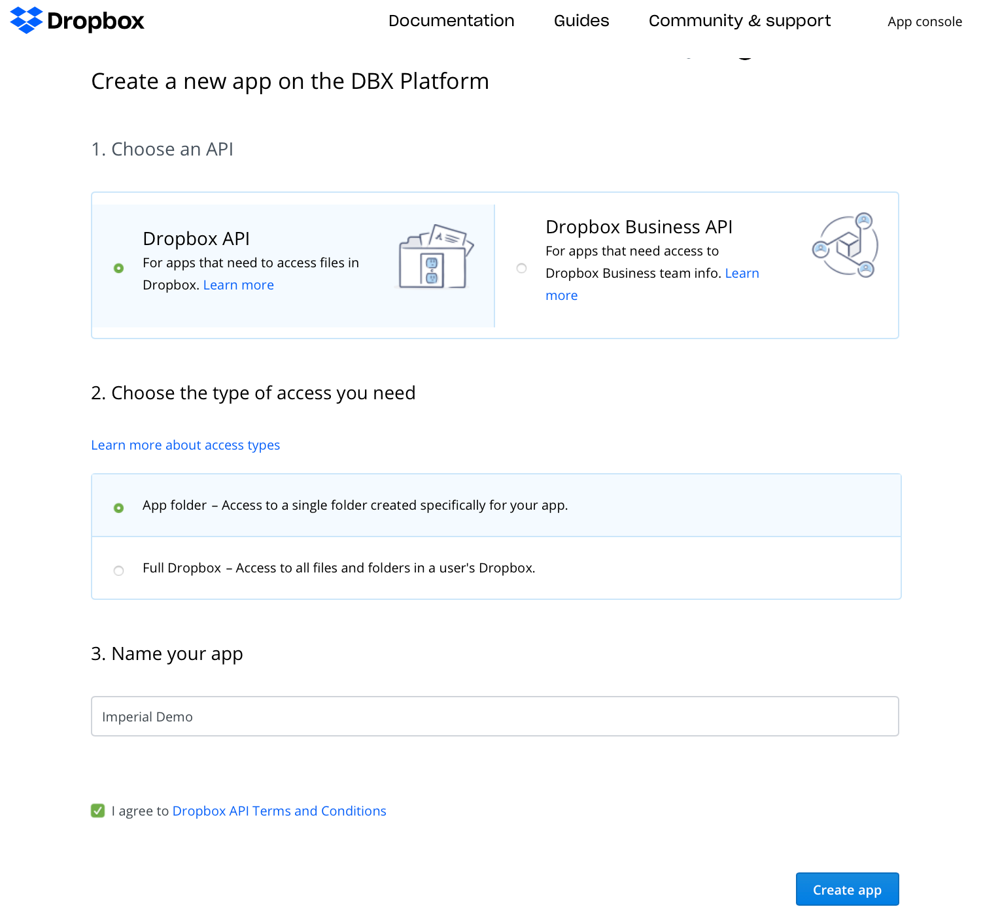

# Federated Login with Dropbox

Start by going to the [Dropbox App console page](https://dropbox.com/developers/apps/). Click the 'Create App' button. Choose your API, access type, and name, then click 'Create App':



Fill in the rest of the app information, particularly the Redirect URIs:


Now that we have an OAuth application registered with Dropbox, we can add Imperial to our project (We will not be going over how to create the project, as I will assume that you have already done that).

Add the following line of code to your `dependencies` array in your package manifest file:

```swift
.package(url: "https://github.com/vapor-community/Imperial.git", from: "0.5.3")
```

**Note:** There might be a later version of the package available, in which case you will want to use that version.

You will also need to add the package as a dependency for the targets you will be using it in:

```swift
.target(name: "App", dependencies: ["Vapor", "Imperial"],
               exclude: [
                   "Config",
                   "Database",
                   "Public",
                   "Resources"
               ]),
```

Then run `vapor update` or `swift package update`. Make sure you regenerate your Xcode project afterwards if you are using Xcode.

Now that Imperial is installed, we need to add `SessionMiddleware` to our middleware configuration:

```swift
public func configure(
    _ config: inout Config,
    _ env: inout Environment,
    _ services: inout Services
) throws {
    //...

    // Register middleware
    var middlewares = MiddlewareConfig() // Create _empty_ middleware config
	// Other Middleware...
    middlewares.use(SessionsMiddleware.self)
    services.register(middlewares)

	//...
}

```

Now, when you run your app and you are using `FluentSQLite`, you will probably get the following error:

```
⚠️ [ServiceError.ambiguity: Please choose which KeyedCache you prefer, multiple are available: MemoryKeyedCache, FluentCache<SQLiteDatabase>.] [Suggested fixes: `config.prefer(MemoryKeyedCache.self, for: KeyedCache.self)`. `config.prefer(FluentCache<SQLiteDatabase>.self, for: KeyedCache.self)`.]
```

Just pick one of the listed suggestions and place it at the top of your `configure` function. If you want your data to persist across server reboots, use `config.prefer(FluentCache<SQLiteDatabase>.self, for: KeyedCache.self)`

Imperial uses environment variables to access the client ID and secret to authenticate with Dropbox. To allow Imperial to access these tokens, you will create these variables, called `DROPBOX_CLIENT_ID` and `DROPBOX_CLIENT_SECRET`, with the App key and App secret assigned to them. Imperial can then access these vars and use their values to authenticate with Dropbox.

Now, all we need to do is register the Dropbox service in your main router method, like this:

```swift
try router.oAuth(from: Dropbox.self, authenticate: "dropbox-login", callback: "http://localhost:8080/dropbox-auth-complete") { (request, token) in
    print(token)
    return Future(request.redirect(to: "/"))
}
```

If you just want to redirect, without doing anything else in the callback, you can use the helper `Route.oAuth` method that takes in a redirect string:

```swift
try router.oAuth(from: Dropbox.self, authenticate: "dropbox-login", callback: "http://localhost:8080/dropbox-auth-complete", redirect: "/")
```

The `authenticate` argument is the path you will go to when you want to authenticate the user. The `callback` argument has to be one of the paths that you entered when you registered your application on Dropbox:


The completion handler is fired when the callback route is called by the OAuth provider. The access token is passed in and a response is returned.

If you ever want to get the `access_token` in a route, you can use a helper method for the `Request` type that comes with Imperial:

```swift
let token = try request.accessToken()
```

Now that you are authenticating the user, you will want to protect certain routes to make sure the user is authenticated. You can do this by adding the `ImperialMiddleware` to a router group (or maybe your middleware config):

```swift
let protected = router.grouped(ImperialMiddleware())
```

Then, add your protected routes to the `protected` group:

```swift
protected.get("me", handler: me)
```

The `ImperialMiddleware` by default passes the errors it finds onto `ErrorMiddleware` where they are caught, but you can initialize it with a redirect path to go to if the user is not authenticated:

```swift
let protected = router.grouped(ImperialMiddleware(redirect: "/"))
```
